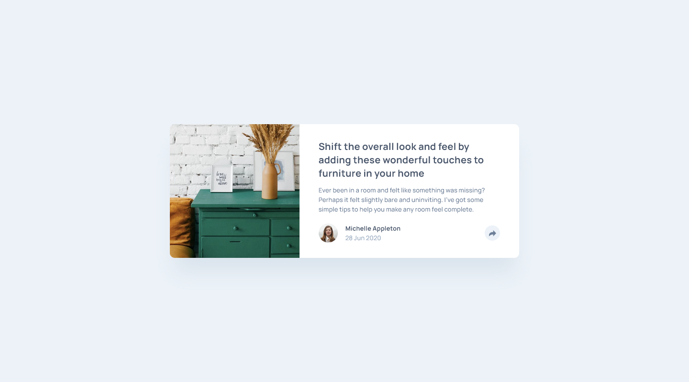

# Frontend Mentor - Article preview component solution

This is a solution to the [Article preview component challenge on Frontend Mentor](https://www.frontendmentor.io/challenges/article-preview-component-dYBN_pYFT). Frontend Mentor challenges help you improve your coding skills by building realistic projects.

### Screenshot

### Links

- Solution URL: [Solution URL here](https://github.com/NDK1195/huddle-landing-page-with-single-introductory-section)
- Live Site URL: [Live site URL here](https://ndk1195.github.io/huddle-landing-page-with-single-introductory-section/)

### Built with

- HTML5
- Tailwind CSS
- React
